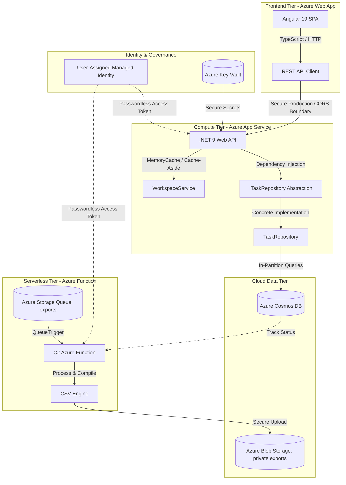

# 🚀 Cloud-Native Project Management Platform (MVP)

A 14-day **Build-in-Public** portfolio sprint showcasing an enterprise-grade, cloud-native project management platform (ClickUp/Jira clone). This repository is engineered with a strict separation of concerns, featuring an **Angular 19** frontend client, a high-performance **.NET 9 Web API** backend, and an async **Azure Function background worker** tied together by **Azure Storage Queues**.

The entire data architecture is built on a pure **NoSQL foundation** via **Azure Cosmos DB**, strictly avoiding legacy relational patterns. The ecosystem uses **Azure User-Assigned Managed Identities** for 100% passwordless authentication across all cloud services (Cosmos DB, Key Vault, and Storage).

---

## 🏗️ System Architecture



---

## 🛠️ Technology Stack Matrix

| Tier | Technology | Description / Justification |
| --- | --- | --- |
| **Frontend** | Angular (v19+) | Component-driven SPA utilizing TypeScript for predictable state scaling, hosted via Azure App Service. |
| **Backend** | .NET 9 Web API | High-throughput enterprise API framework using C# and clean Dependency Injection. |
| **Async Worker** | Azure Functions (v4) | Serverless execution model hosting queue-triggered background processes independently. |
| **Database** | Azure Cosmos DB (NoSQL) | Distributed NoSQL engine chosen for flexible JSON modeling and sub-millisecond point reads. |
| **Secrets Engine** | Azure Key Vault | Centralized secure management for sensitive cryptographic settings and app signing tokens. |
| **Storage & Messaging** | Azure Storage Accounts | High-scale Blob storage for user artifacts and Storage Queues for system decoupling. |
| **Identity** | Microsoft Entra ID | Employs User-Assigned Managed Identities to ensure zero connection strings are hardcoded. |
| **DevOps / IaC** | Bicep & GitHub Actions | Infrastructure as Code configuration tracking drift, powering automated multi-project CI/CD builds. |

---

## 🗂️ Monorepo Structure

```text
project-mgmt-mvp/
├── .github/workflows/
│   └── deploy.yml            # Multi-job GitHub Actions pipeline (API, Frontend, & Function)
├── infra/
│   └── main.bicep            # Declarative IaC file representing 100% of live Azure assets
├── backend/                  # .NET 9 Core Web API Application
│   ├── Interfaces/           # Decoupled abstract data definitions (ITaskRepository)
│   ├── Infrastructure/       # Concrete Cosmos SDK data mappings and repository engines
│   ├── Services/             # WorkspaceService housing Day 3 Cache-Aside logic
│   ├── Program.cs            # App bootstrapper, CORS policy enforcement, & Identity setup
│   └── appsettings.json      # Local configuration boundaries
├── function-app/             # C# Serverless Azure Function App (Day 8 Background Worker)
└── frontend/                 # Angular Client Single Page Application (SPA)

```

---

## 🔑 Core NoSQL Architecture Decisions

To maximize horizontal scaling capabilities while strictly respecting the **AZ-204 (Azure Developer Associate)** design criteria, the data layer relies on an **In-Partition Query** strategy across a shared-throughput database configuration:

* **Polymorphic Container (`WorkspacesAndTasks`):** Uses `/workspaceId` as the Partition Key. Both workspace metadata and individual tasks are co-located here. This ensures fetching an entire Kanban board requires a single, fast, low-cost partition target read instead of an expensive cross-partition scan.
* **Isolated Profile Container (`Users`):** Uses `/id` as the Partition Key to allow rapid point-read lookups (costing a flat $1\text{ RU}$) during user profile parsing and validation routines without duplicating data records across multiple workspace silos.

---

## 🔒 Production Security Boundaries (Day 6 & 7.5 Milestones)

* **Zero-Connection-String Policy:** Neither `appsettings.json` nor Cloud App Settings contain passwords. The local development runtime falls back to local CLI credentials, while production Web Apps use an Azure User-Assigned Managed Identity via `DefaultAzureCredential`.
* **CORS Network Lockdown:** Cross-Origin Resource Sharing is locked down tightly in `Program.cs`. The API rejects traffic from any origin unless it explicitly matches the verified production frontend URL.
* **Infrastructure Drift Mitigation:** Ad-hoc terminal scripts or manual Azure Portal changes are completely banned. Any expansion of cloud assets (such as Day 8 queues and private blob containers) is codified within `infra/main.bicep` prior to deployment.

---

## 🚀 Getting Started (Local Development Setup)

### Prerequisites

* [.NET 9 SDK](https://dotnet.microsoft.com/download)
* [Node.js (v24) & Angular CLI](https://angular.dev/)
* [Azure Cosmos DB Emulator](https://learn.microsoft.com/en-us/azure/cosmos-db/emulator)
* [Azurite](https://github.com/Azure/Azurite) (Local Storage Blob & Queue Emulator)

### 1. Database & Queue Emulator Startup

Ensure your local Cosmos DB Emulator and Azurite are active. Using the Cosmos Emulator data explorer, provision:

* Database ID: `ProjectMgmtDB` *(Shared Throughput: 400 - 1000 RU/s)*
* Container 1: `WorkspacesAndTasks` $\rightarrow$ Partition Key: `/workspaceId`
* Container 2: `Users` $\rightarrow$ Partition Key: `/id`

### 2. Launch the Backend API

```bash
cd backend
dotnet restore
dotnet run

```

### 3. Launch the Frontend Client

```bash
cd frontend
npm ci
ng serve

```

---

## 📅 14-Day Sprint Progress Tracker

* [x] **Day 1:** Monorepo Initialization, .NET 9/Angular App scaffolding, and Emulator Configurations.
* [x] **Day 2:** Cosmos DB Schema Design, Partition Key Strategy, and Repository Pattern implementation.
* [x] **Day 3:** RESTful API CRUD Controllers & MemoryCache Cache-Aside Optimization.
* [x] **Day 4:** Workspace Management APIs & Multi-Document Transaction Execution Patterns.
* [x] **Day 5:** Kanban Board Task Sorting, Filtering, and Document Splitting Rules.
* [x] **Day 6:** Azure Key Vault configuration, Blob Service Registration, and Passwordless Managed Identity setup.
* [x] **Day 7:** Production Resource Provisioning, Azure Web App hosting, and Multi-Artifact GitHub Actions Automation.
* [x] **Day 7.5:** Architectural Reconciliation — Production CORS setup, Bicep Drift corrections, and CI/CD Function App inclusion.
* [ ] **Day 8:** Async Export Pipeline — Azure Storage Queue Producers and Serverless Function Consumers *(In Progress)*
* [ ] **Day 9 - 14:** *Building in public...*