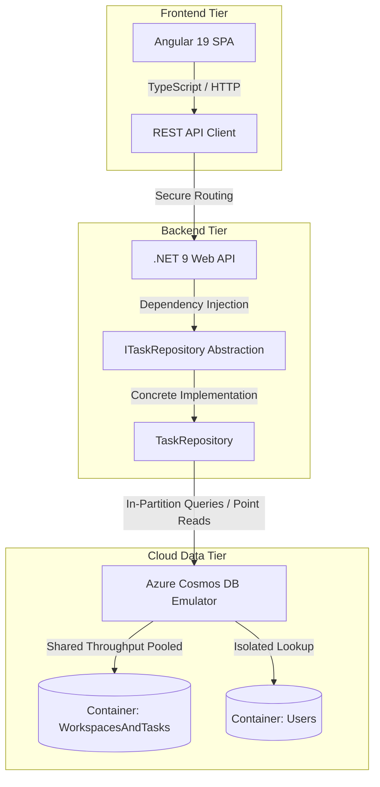

# 🚀 Cloud-Native Project Management Platform (MVP)

A 14-day **Build-in-Public** portfolio sprint showcasing an enterprise-grade, cloud-native project management platform (ClickUp/Jira clone). This repository is engineered with a strict separation of concerns, featuring an **Angular** frontend monorepo client and a high-performance **.NET 9 Web API** backend leveraging **Azure Cosmos DB (NoSQL)**.

The entire architecture is optimized to run locally via cross-platform emulators while remaining fully compatible with Azure production boundaries within the **Azure Always Free Tier** envelope.

---

## 🏗️ System Architecture



---

## 🛠️ Technology Stack Matrix

| Tier | Technology | Description / Justification |
| --- | --- | --- |
| **Frontend** | Angular (v19+) | Component-driven, highly structured SPA utilizing TypeScript for predictable state scaling. |
| **Backend** | .NET 9 Web API | High-throughput, cross-platform enterprise framework utilizing C# and clean dependency injection. |
| **Database** | Azure Cosmos DB (NoSQL API) | Distributed NoSQL engine selected for flexible JSON document modeling and sub-millisecond point reads. |
| **Local Infra** | Azure Cosmos Emulator | Allows full offline development and execution of cloud-native data patterns without incurring live Azure costs. |

---

## 🗂️ Monorepo Structure

```text
project-mgmt-mvp/
├── .github/                  # CI/CD Workflows
├── backend/                  # .NET 9 Core Web API Application
│   ├── src/
│   │   ├── Infrastructure/
│   │   │   ├── Repositories/ # Concrete Task & Workspace Cosmos SDK storage calls
│   │   │   └── Data/         # NoSQL Schema Design documents and architectural logs
│   │   └── Models/           # Strongly typed domain objects (TaskItem, Workspace, User)
│   ├── Interfaces/           # Decoupled abstract data definitions (ITaskRepository)
│   ├── Program.cs            # App bootstrapper, Singleton CosmosClient, & DI engine
│   └── appsettings.json      # Local configurations & Emulator master key pairs
└── frontend/                 # Angular Client Single Page Application (SPA)

```

---

## 🔑 Core NoSQL Architecture Decisions (Day 2 Milestone)

To maximize horizontal scaling capabilities while strictly respecting the **AZ-204 (Azure Developer Associate)** design criteria, the data layer relies on an **In-Partition Query** strategy across a shared-throughput database configuration:

* **Polymorphic Container (`WorkspacesAndTasks`):** Uses `/workspaceId` as the Partition Key. Both workspace metadata and individual tasks are co-located here. This ensures fetching an entire Kanban board requires a single, fast, low-cost partition target read instead of an expensive cross-partition scan.
* **Isolated Profile Container (`Users`):** Uses `/id` as the Partition Key to allow rapid point-read lookups (costing a flat $1\text{ RU}$) during user profile parsing and validation routines without duplicating data records across multiple workspace silos.

---

## 🚀 Getting Started (Local Development Setup)

### Prerequisites

* [.NET 9 SDK](https://dotnet.microsoft.com/download)
* [Node.js (v20+) & Angular CLI](https://angular.dev/)
* [Azure Cosmos DB Emulator](https://learn.microsoft.com/en-us/azure/cosmos-db/emulator) (Windows native, or Linux/macOS running via Docker)

### 1. Database Emulator Startup

Ensure your local Cosmos DB Emulator is running. By default, it exposes the local gateway at `https://localhost:8081/`.
Using the emulator's web **Data Explorer**, provision the following structural schema:

* Database ID: `ProjectMgmtDB` *(Configure with Shared Throughput: 400 - 1000 RU/s)*
* Container 1: `WorkspacesAndTasks` $\rightarrow$ Partition Key: `/workspaceId`
* Container 2: `Users` $\rightarrow$ Partition Key: `/id`

### 2. Launch the Backend API

Navigate to the server directory, install native package dependencies, and spin up the .NET environment:

```bash
cd backend
dotnet restore
dotnet run

```

*The API will boot locally, automatically reading connection metrics and mapping routes. You can verify endpoint bindings by opening the native OpenAPI/Swagger UI platform index.*

### 3. Launch the Frontend Client

Open a secondary terminal workspace, navigate to the client engine UI folder, and run the development compilation pipeline:

```bash
cd frontend
npm install
ng serve

```

*Open your web browser and navigate to `http://localhost:4200` to interact with the UI client.*

---

## 📅 14-Day Sprint Progress Tracker

* [x] **Day 1:** Monorepo Initialization, .NET 9/Angular App scaffolding, and Emulator Configurations.
* [x] **Day 2:** Cosmos DB Schema Design, Partition Key Strategy, and Repository Pattern implementation in C#.
* [ ] **Day 3:** RESTful API CRUD Controllers & Cache-Aside Optimization Implementation *(Upcoming)*
* [ ] **Day 4 - 14:** *Building in public...*
